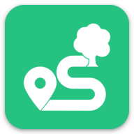
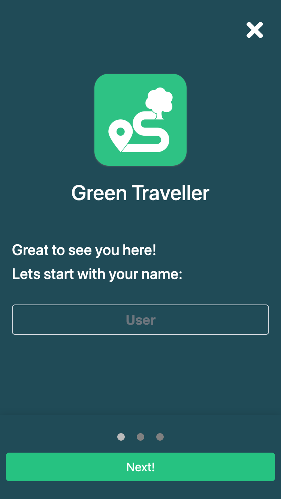
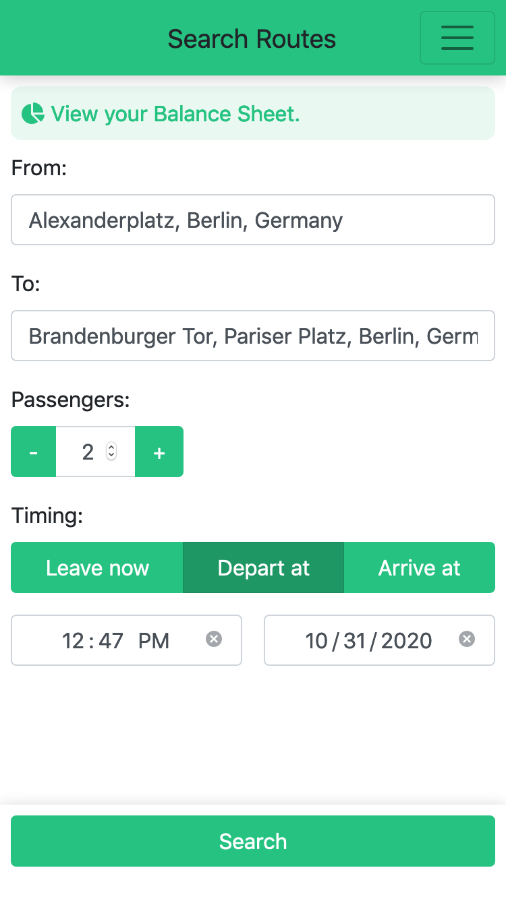
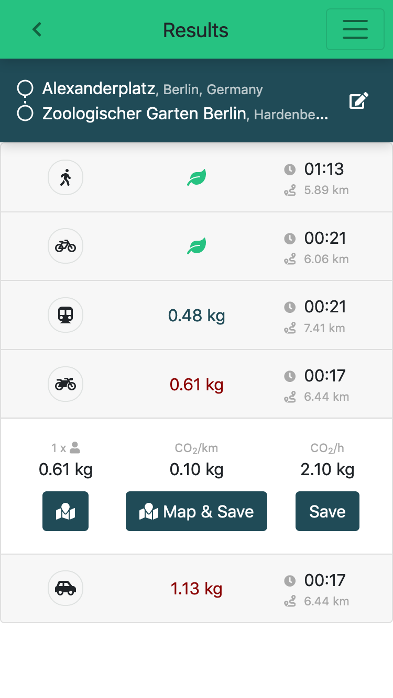
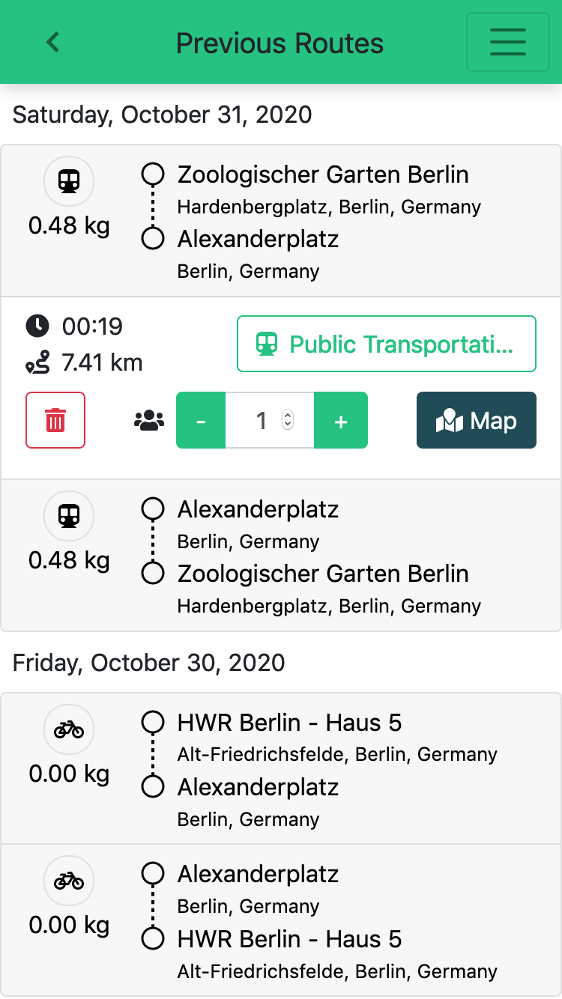
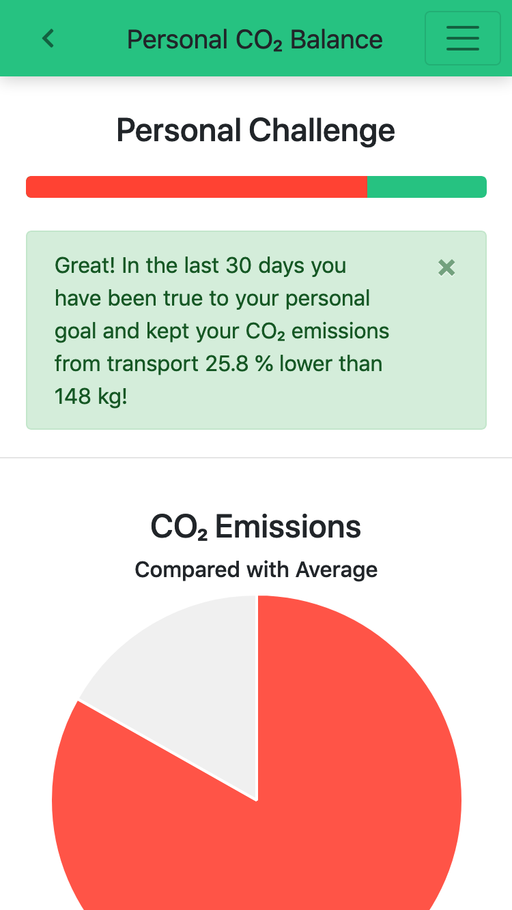
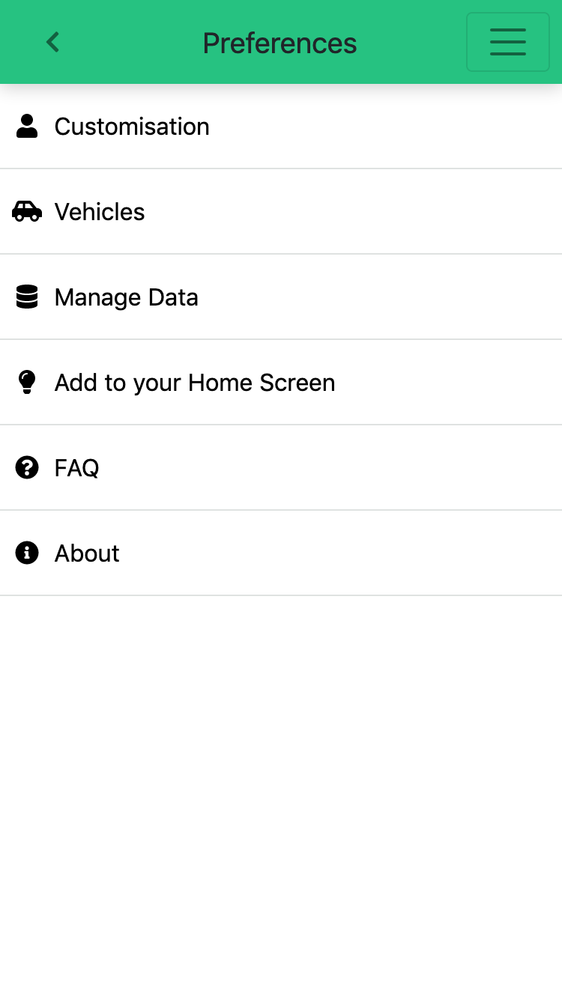
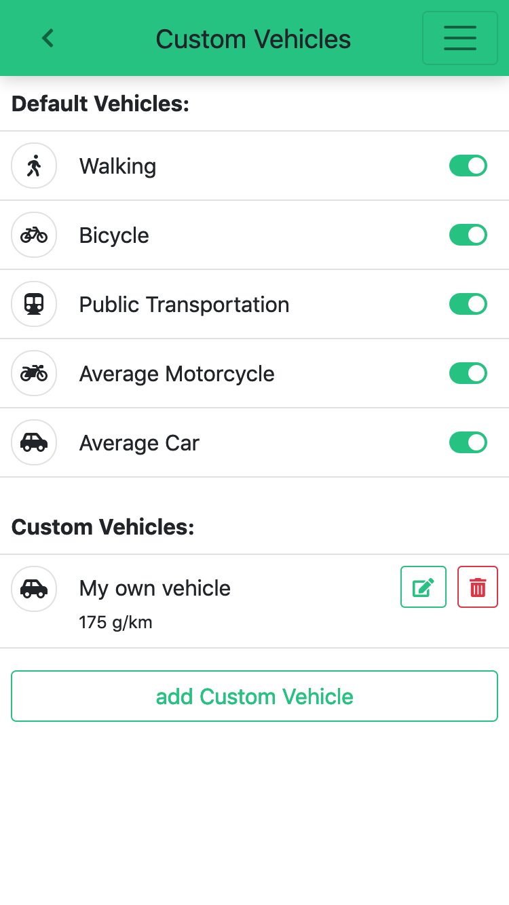

<div style="display: flex; justify-content: center">
    
</div>

# 🚴🌳 Green Traveller

| [Landing Page](https://green-traveller.github.io/) | [App](https://green-traveller.github.io/web/) |
| --- | --- |

## Features

* easy and user-friendly onboarding

## Screenshots

<div style="display: flex; justify-content: space-between">
    
    
    
    
    
    
    
</div>

## Usage

### Setup

You need `node.js` installed in your environment.
Run `npm install` to install the dependencies.
To have all features available place a `.config.json` file in the root folder of the project with the following content:

```
{
  "keys": {
    "dev": "<Your Google Maps API Key>"
  }
}
```

### Development

Run `ng serve` for a dev server. Navigate to `http://localhost:4200/`. The app will automatically reload if you change any of the source files.

### Build

Run `ng build` to build the project. The build artifacts will be stored in the `dist/` directory. Use the `--prod` flag for a production build.


### Further help

To get more help on the Angular CLI use `ng help` or go check out the [Angular CLI README](https://github.com/angular/angular-cli/blob/master/README.md).
